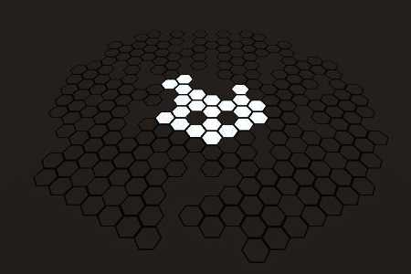

# unity-package-library-CubeCoordinates

Unity package providing a cube coordinate system and methods for building hexagonal tile grids for interactive gameplay.

|  |  |  |
| ---------------------------------------------------------- | ---------------------------------------- | ---------------------------------------------------------- |

## CubeCoordinates

To install, copy the `CubeCoordinates` Unity Package directory into your project's `Packages` directory.

```csharp
using CubeCoordinates;

...

Coordinates coordinates = Coordinates.Instance;
coordinates.SetCoordinateType(Coordinate.Type.GenerateMesh);

List<Vector3> cubes = Cubes.GetNeighbors(Vector3.zero, 10);
coordinates.CreateCoordinates(cubes);

coordinates.Build();
```

Please check the [examples](examples) folder and [documentation](documentation/index.html) to learn more.

---

## Quick Introduction

#### Coordinates

Used to create and manage `Coordinate` instances, it uses an `"all"` default `Container` as the master list for it's methods.

```csharp
Coordinates coordinates = Coordinates.Instance;
coordinates.SetCoordinateType(Coordinate.Type.Prefab, myGameObject);

coordinates.CreateCoordinates(
    Cubes.GetNeighbors(Vector3.zero, 10)
);

Coordinate origin = coordinates.GetContainer().GetCoordinate(Vector3.zero);
Coordinate destination = coordinates.GetContainer().GetCoordinate(new Vector3(4,1,-5));

Coordinates.Instance.Build();

List<Coordinate> diff = coordinates.BooleanDifference(
    coordinates.GetNeighbors(origin, 4),
    coordinates.GetNeighbors(origin, 2)
);

List<Coordinate> path = Coordinates.Instance.GetPath(origin, destination);
```

#### Coordinate

Individual `Coordinate` instances represents tiles on the grid. It's purpose is to keep track of cube coordinates, transform position in world space, reference any GameObject instantiated to represent it, facilitate path finding by storing cost values and be supplied as an origin for many `Coordinate` operations.

```csharp
Coordinate coordinate = Coordinates.Instance.GetContainer().GetCoordinate(new Vector3(4,1,-5));
myGameObject.transform.position = coordinate.position;
coordinate.SetGameObject(myGameObject);
```

#### Container

Any number of `Container` instances can be optionally created - except for `"all"`, which `Coordinates` uses as a master list internally - to manage your own lists of `Coordinate` instances that you can later retrieve for your own purposes.

```csharp
Container moveArea = Coordinates.Instance.GetContainer("move_area");
moveArea.AddCoordinates( new List<Coordinate>{coordinateA, coordinateB});

foreach(Coordinate c in moveArea.GetAllCoordinates())
    c.go.GetComponent<MyScript>().DoSomething();

movement_range.RemoveAllCoordinates();
```

#### Cubes

Collection of cube coordinate system methods for calculating desired coordinate results. These methods _do not_ map to `Coordinate` instances; they simply calculate results from an infinite plane of coordinates as requested. Using `Cubes` directly is desirable when combining several operations together because you can calculate the results and last pull any matching `Coordinate` instances from a `Container` by supplying the results.

```csharp
List<Vector3> attackShape = Cubes.BooleanCombine(
    Cubes.GetRing(Vector3.zero, 4),
    Cubes.GetDiagonalNeighbors(Vector3.zero, 3)
);

Vector3 activeCube = Cubes.ConvertWorldPositionToCube(myGameObject.transform.position);

List<Vector3> attackShapeOnMap = new List<Vector3>();
foreach (Vector3 cube in attackShape)
    attackShapeOnMap.Add(cube + activeCube);

Container attackTiles = Coordinates.Instance.GetContainer("attack_tiles");
List<Coordinate> attackShapeCoordinates = attackTiles.GetCoordinates(attackShapeOnMap);

foreach (Coordinate c in attackShapeCoordinates)
    c.go.GetComponent<MyScript>().DoSomething();
```

#### MeshCreator

Used to generate hexagonal meshes when using `Coordinate.Type.GenerateMesh` which is useful for debugging.

---

### Development

This package is being developed as part of a hobby indie game - TBD Tactical RPG - and there are no plans for a development roadmap or gaurantee of non-breaking changes between versions. I welcome any bug reports or suggestions, but please consider this as a resource for learning and if you intend to use it, make a fork so you can maintain a stable copy or extend it however you wish. This `CubeCoordinates` library is an implementation of the following:

https://www.redblobgames.com/grids/hexagons/
