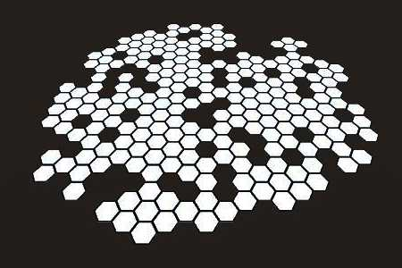

# unity-package-library-CubeCoordinates

Unity package providing a cube coordinate system and methods for building hexagonal tile grids for interactive gameplay.

|  |  |  |
| ---------------------------------------------------------- | ---------------------------------------- | ---------------------------------------------------------- |

## CubeCoordinates

To install, copy the `CubeCoordinates` Unity Package directory into your project's `Packages` directory.

```csharp
using CubeCoordinates;

...

Coordinates coordinates = Coordinates.Instance;
coordinates.SetCoordinateType(Coordinate.Type.GenerateMesh);

List<Vector3> cubes = Cubes.GetNeighbors(Vector3.zero, 10);
coordinates.CreateCoordinates(cubes);

coordinates.Build();
```

Please go to the [examples](examples) folder to see more complex usages.

---

#### Coordinates

Used to create and manage `Coordinate` instances, it provides a default `Container` labelled `"all"` which is treated as the master list which all methods operate.

```csharp
Coordinates.Instance.SetCoordinateType(Coordinate.Type.Prefab, myGameObject);

Coordinates.Instance.CreateCoordinates(
    Coordinates.GetNeighbors(Vector3.zero, 10)
);

Coordinates.Instance.Build();

List<Coordinate> diff = Coordinates.Instance.BooleanDifference(
    Coordinates.Instance.GetNeighbors(Vector3.zero, 4);
    Coordinates.Instance.GetNeighbors(Vector3.zero, 2);
);

List<Coordinate> path = Coordinates.Instance.GetPath(origin, destination);
```

#### Coordinate

An individual `Coordinate` instance represents a tile on the grid, keeps track of it's own cube coordinate, transform positon and GameObject associated with it, and can be used in various methods to find other `Coordinate` instances.

```csharp
Coordinate coordinate = Coordinates.Instance.GetContainer().GetCoordinate(new Vector3(4,1,-5));
myGameObject.transform.position = coordinate.position;
coordinate.SetGameObject(myGameObject);
```

#### Container

Any number of `Container` instances can be created (optional, except for the default `"all"`) in order to track your own lists of `Coordinate` instances to be retreived later for your own purposes.

```csharp
Container movement_range = Coordinates.Instance.GetContainer("movement_range");
movement_range.AddCoordinates( new List<Coordinate>{coordinateA, coordinateB});

foreach(Coordinate c in movement_range.GetAllCoordinates())
    c.go.GetComponent<MyScript>().DoSomething();

movement_range.RemoveAllCoordinates();
```

#### Cubes

Collection of cube coordinate system methods for quickly calculating desired coordinate results. Primarily used by the `Coordinates` class, it returns coordinate results without guarantee they have been instantiated. Using `Cubes` directly is desireable for combining serveral operations together before retreiving the results from a `Container`.

```csharp
List<Vector3> attackShape = Cubes.BooleanCombine(
    Cubes.GetRing(Vector3.zero, 4),
    Cubes.GetDiagonalNeighbors(Vector3.zero, 3)
);

Vector3 activeCube = Cubes.ConvertWorldPositionToCube(myGameObject.transform.position);

List<Vector3> attackShapeTransformed = new List<Vector3>();
foreach(Vector3 cube in attackShape)
    attack.Add(cube + activeCube);

Container attack = Coordinates.Instances.GetContainer("attack");
List<Coordinate> attachShapeCoordinates = attack.GetCoordinates(attackShapeTransformed);
```

#### MeshCreator

Used to generate hexagonal meshes when using `Coordinate.Type.GenerateMesh` which is useful for debugging.

---

### Development

This package is being developed as part of a hobby indie game (Tactical RPG, TBD). There are no immediate plans to add features, improve useability or support users of this library. `CubeCoordinates` is an implementation of:

https://www.redblobgames.com/grids/hexagons/
